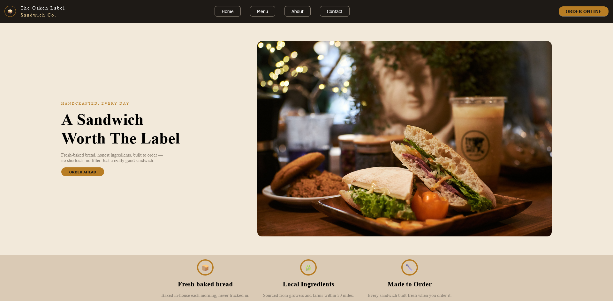

# 🥪 Restaurant Page - The Oaken Label


A go-to gourmet sandwich shop, brought to the web through <a href="https://www.theodinproject.com/" alt="The Odin Project">The Odin Project</a> curriculum.

## 📚 About The Project

The Oaken Label is a fictional fine dining sandwich shop nestled in the fictional town of BrookHaven. This project takes on The Odin Project's Restaurant Page assignment and drafts a fully responsive single page application for the shop's fictional owners.

The site includes 4 dynamically render pages `Home` `Menu` `About` and `Contact` that are all rendered through JavaScript and DOM manipulation. 


🌐<a href="https://sivil07.github.io/Restaurant-Page/" alt="Live Site">Live Site</a>



### ✨ Features

- Client-side page routing: the Home, Menu, About, and Contact pages are built and swapped in place via a dedicated `PageWatcher` class, which updates the document title and active page without triggering a page reload.
- Data driven content: every page's text, icons, and images are generated from structured objects exported from content.js.
- Modular page builders: each page (`HomeBuilder`, `MenuBuilder`, `AboutBuilder`, `ContactBuilder`) is its own class and assembles itself using smaller, independent builder methods.
- Responsive Navigation: a hamburger menu on smaller screens that closes on outside clicks or when navigating to a new page, and a full nav bar on larger screens.
- Animated menu browsing: menu categories switch from a card to a row layout depending on the option you've selected.
- Sticky header: the header stays fixed above the page while scrolling, without shifting position.

### 📁 Project Structure

```
project/
├── src/
│   ├── assets/
│   │   └── img/
│   └── public/
│       ├── css/
│       │   ├── global.css
│       │   ├── home.css
│       │   ├── menu.css
│       │   ├── about.css
│       │   └── contact.css
│       ├── js/
│       │   ├── aboutBuilder.js
│       │   ├── contactBuilder.js
│       │   ├── content.js
│       │   ├── elementBuilder.js
│       │   ├── homeBuilder.js
│       │   ├── index.js
│       │   ├── menuBuilder.js
│       │   ├── navBuilder.js
│       │   ├── nodeCollector.js
│       │   ├── pageLoader.js
│       │   └── pageWatcher.js
│       └── template.html
├── .gitignore
├── package.json
├── webpack.config.js
└── README.md
```
#### 🏗️ Application Architecture
- `template.html` is the main HTML file that holds the header and navigation. It also contains the `#content` element where JavaScript loads each page dynamically.
- `index.js` is the Webpack entry point. It initializes the nav, loads the initial page, and connects the navigation listeners to wait for page changes.
- `elementBuilder.js` is a small shared utility used by every page builder to create DOM elements from a single configuration object which lets you specify the tag, id, classes, attributes and other options for the element you want to create.
- `content.js` holds all page content data as plain objects and is imported to whichever builder needs them.
- `homeBuilder.js`, `menuBuilder.js`, `aboutBuilder.js`, and `contactBuilder.js` each build one page's full DOM tree from `content.js` and expose it through their own method: `buildHomePage()`, `buildMenuPage()`, `buildAboutPage()`, and `buildContactPage()`.
- `pageWatcher.js` listens for nav clicks, maps them to the correct page builder, and swaps the old mounted page for the new one.
- `pageLoader.js` and `nodeCollector.js` handle inserting/removing the active page from `#content` and tracks a reference to it between page swaps.
- `navBuilder.js` builds the nav bar's buttons from each page builder's own `name` getter, so the nav always reflects whatever pages actually exist.

## 📦 Getting Started

### 🧰 Prerequisites

Before running the project locally, make sure you have the following installed:
- **Node.js** - ideally the latest LTS version
- **npm** - bundled with *Node.js*
- **Git** - only if you plan to clone the repository

### 📋 Instructions

1. Clone the repo

```
git clone https://github.com/Sivil07/REPOSITORY-NAME.git
```

2. Enter the directory

```
cd REPOSITORY-NAME
```

3. Install the dependencies

```
npm install
```

4. Start the WebPack dev server 

```
npx webpack serve
```

5. Visit the site in your browser

```
http://localhost:8080
```

## 🚀 Deployment

>[!NOTE]
> These steps are only needed if you want to deploy your own version of the project to GitHub Pages. If you're just running the project locally, you can ignore this section.


This project deploys to GitHub Pages from a `gh-page` branch and built from the bundled `dist/` directory.

**First Deployment only** - create the deployment branch:

```
git branch gh-pages
```

Every deployment or redeployment show follow these steps:

1. Make sure all your work is committed. `git status` will show anything pending
2. Switch to `gh-pages` and sync it with `main`

```
git checkout gh-pages && git merge main --no-edit
```
3. Bundle the application into `dist/`

```
npx webpack
```

4. Commit `dist` contents and push to `gh-pages` branch:

```
git add dist -f && git commit -m "Deployment commit"
git subtree push --prefix dist origin gh-pages
git checkout main
```
5. In the repository's settings, set the GitHub pages source branch to `gh-pages` and that's about it. 


## 🙏 Acknowledgements 

All images were used from <a href="https://www.pexels.com/" alt="Pexels">Pexels</a>
